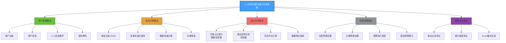

```mermaid
graph TD
    A[个人财务记账与统计分析系统] --> B[用户管理模块]
    A --> C[收支记账模块]
    A --> D[统计分析模块]
    A --> E[预算管理模块]
    A --> F[数据导出模块]
    
    B --> B1[用户注册]
    B --> B2[用户登录]
    B --> B3[个人信息维护]
    B --> B4[密码修改]
    
    C --> C1[收支记录CRUD]
    C --> C2[多条件组合查询]
    C --> C3[模板快速记账]
    C --> C4[分类筛选]
    
    D --> D1[分类占比统计<br/>饼图/柱状图]
    D --> D2[收支趋势分析<br/>折线图]
    D --> D3[同比环比计算]
    D --> D4[数据聚合查询]
    
    E --> E1[月度预算设置]
    E --> E2[分类预算设置]
    E --> E3[预算执行进度]
    E --> E4[超支预警提示]
    
    F --> F1[收支记录导出]
    F --> F2[统计报表导出]
    F --> F3[Excel格式生成]
    
    style A fill:#409EFF,stroke:#333,stroke-width:2px,color:#fff
    style B fill:#67C23A,stroke:#333,stroke-width:1px
    style C fill:#E6A23C,stroke:#333,stroke-width:1px
    style D fill:#F56C6C,stroke:#333,stroke-width:1px
    style E fill:#909399,stroke:#333,stroke-width:1px
    style F fill:#8E44AD,stroke:#333,stroke-width:1px
```