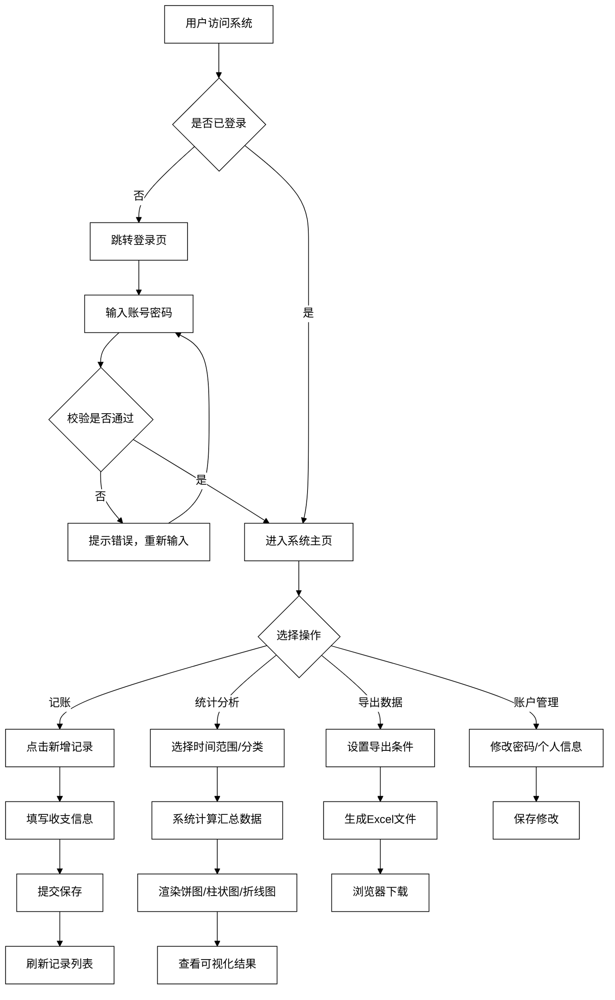

```mermaid
%%{init: {
    'theme': 'base',
    'themeVariables': {
        'primaryColor': '#ffffff',
        'primaryTextColor': '#000000',
        'primaryBorderColor': '#000000',
        'lineColor': '#000000',
        'secondaryColor': '#ffffff',
        'tertiaryColor': '#ffffff',
        'nodeBorder': '#000000',
        'clusterBkg': '#ffffff',
        'clusterBorder': '#000000'
    }
}}%%
flowchart TD
    Start[用户访问系统]
    IsLogin{是否已登录}
    LoginPage[跳转登录页]
    InputAccount[输入账号密码]
    CheckLogin{校验是否通过}
    LoginFail[提示错误，重新输入]
    MainPage[进入系统主页]
    SelectAction{选择操作}

    %% 记账流程
    AddRecord[点击新增记录]
    FillInfo[填写收支信息]
    SubmitSave[提交保存]
    RefreshList[刷新记录列表]

    %% 统计分析流程
    SelectRange[选择时间范围/分类]
    CalcData[系统计算汇总数据]
    RenderChart[渲染饼图/柱状图/折线图]
    ViewResult[查看可视化结果]

    %% 导出数据流程
    SetExport[设置导出条件]
    GenExcel[生成Excel文件]
    Download[浏览器下载]

    %% 账户管理流程
    ModifyInfo[修改密码/个人信息]
    SaveChange[保存修改]

    %% 流程连线
    Start --> IsLogin
    IsLogin -->|否| LoginPage
    LoginPage --> InputAccount
    InputAccount --> CheckLogin
    CheckLogin -->|否| LoginFail
    LoginFail --> InputAccount
    CheckLogin -->|是| MainPage
    IsLogin -->|是| MainPage
    MainPage --> SelectAction

    %% 记账分支
    SelectAction -->|记账| AddRecord
    AddRecord --> FillInfo
    FillInfo --> SubmitSave
    SubmitSave --> RefreshList

    %% 统计分析分支
    SelectAction -->|统计分析| SelectRange
    SelectRange --> CalcData
    CalcData --> RenderChart
    RenderChart --> ViewResult

    %% 导出数据分支
    SelectAction -->|导出数据| SetExport
    SetExport --> GenExcel
    GenExcel --> Download

    %% 账户管理分支
    SelectAction -->|账户管理| ModifyInfo
    ModifyInfo --> SaveChange
```