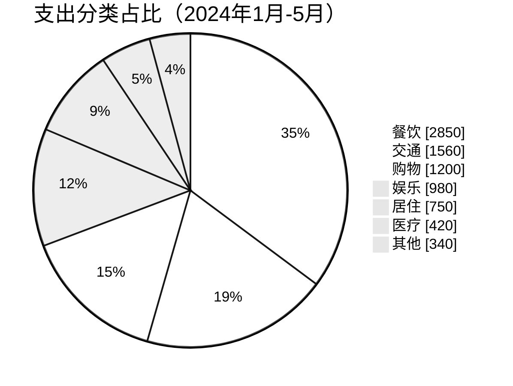

```mermaid
%%{init: {
    'theme': 'base',
    'themeVariables': {
        'primaryColor': '#ffffff',
        'primaryTextColor': '#000000',
        'primaryBorderColor': '#000000',
        'lineColor': '#000000',
        'pie': {
            'borderColor': '#000000',
            'labelColor': '#000000',
            'backgroundColor': '#ffffff',
            'colors': ['#ffffff', '#f0f0f0', '#e0e0e0', '#d0d0d0', '#c0c0c0', '#b0b0b0', '#a0a0a0']
        },
        'fontSize': '12px'
    },
    'pie': {
        'maxWidth': 240,
        'minWidth': 200,
        'radius': 0.8
    }
}}%%
pie showData
    title 支出分类占比（2024年1月-5月）
    "餐饮" : 2850
    "交通" : 1560
    "购物" : 1200
    "娱乐" : 980
    "居住" : 750
    "医疗" : 420
    "其他" : 340
```