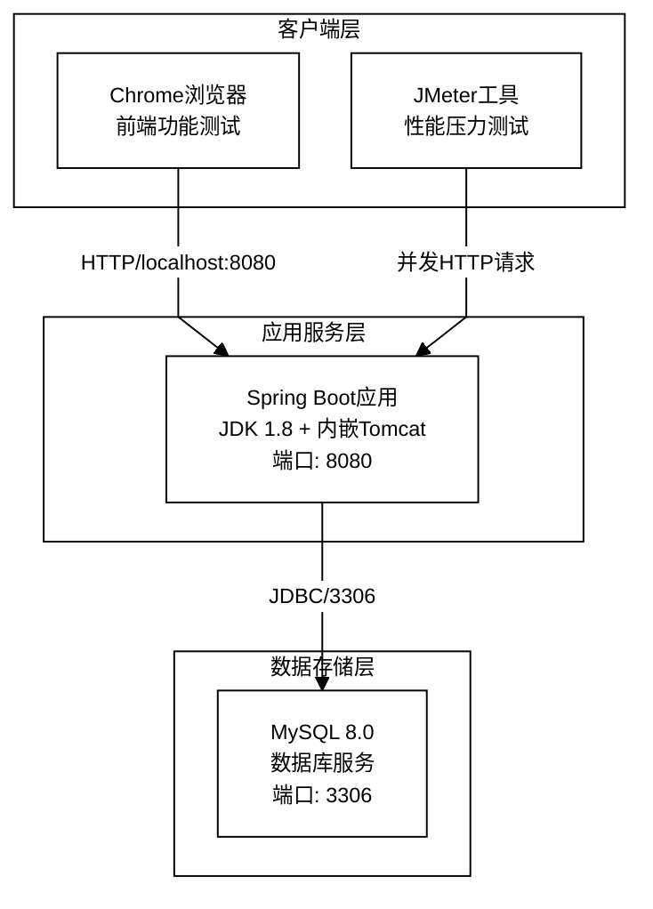

```mermaid
%%{init: {
    'theme': 'base',
    'themeVariables': {
        'primaryColor': '#ffffff',
        'primaryTextColor': '#000000',
        'primaryBorderColor': '#000000',
        'lineColor': '#000000',
        'secondaryColor': '#ffffff',
        'tertiaryColor': '#ffffff',
        'clusterBkg': '#ffffff',
        'clusterBorder': '#000000',
        'fontSize': '12px'
    },
    'flowchart': {
        'rankSpacing': 45,
        'nodeSpacing': 30,
        'curve': 'linear',
        'useMaxWidth': true,
        'maxWidth': 140
    }
}}%%
flowchart TB
    subgraph 客户端层
        B1[Chrome浏览器<br/>前端功能测试]
        B2[JMeter工具<br/>性能压力测试]
    end
    
    subgraph 应用服务层
        direction TB
        APP[Spring Boot应用<br/>JDK 1.8 + 内嵌Tomcat<br/>端口: 8080]
    end
    
    subgraph 数据存储层
        direction TB
        DB[MySQL 8.0<br/>数据库服务<br/>端口: 3306]
    end
    
    B1 -->|HTTP/localhost:8080| APP
    B2 -->|并发HTTP请求| APP
    APP -->|JDBC/3306| DB
```