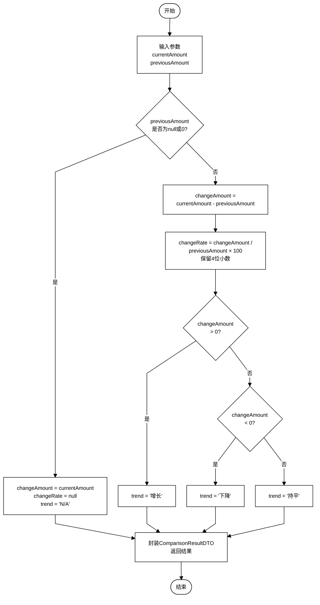

```mermaid
%%{init: {
    'theme': 'base',
    'themeVariables': {
        'primaryColor': '#ffffff',
        'primaryTextColor': '#000000',
        'primaryBorderColor': '#000000',
        'lineColor': '#000000',
        'secondaryColor': '#ffffff',
        'tertiaryColor': '#ffffff',
        'fontSize': '12px'
    },
    'flowchart': {
        'rankSpacing': 40,
        'nodeSpacing': 25,
        'curve': 'linear',
        'useMaxWidth': true,
        'maxWidth': 140
    }
}}%%
flowchart TD
    Start([开始]) --> Input[输入参数<br/>currentAmount<br/>previousAmount]
    Input --> Check{previousAmount<br/>是否为null或0?}
    
    Check -->|是| Result1[changeAmount = currentAmount<br/>changeRate = null<br/>trend = 'N/A']
    Check -->|否| Calc1[changeAmount =<br/>currentAmount - previousAmount]
    
    Calc1 --> Calc2[changeRate = changeAmount /<br/>previousAmount × 100<br/>保留4位小数]
    Calc2 --> Judge{changeAmount<br/>> 0?}
    
    Judge -->|是| Result2[trend = '增长']
    Judge -->|否| Judge2{changeAmount<br/>< 0?}
    
    Judge2 -->|是| Result3[trend = '下降']
    Judge2 -->|否| Result4[trend = '持平']
    
    Result1 --> Return[封装ComparisonResultDTO<br/>返回结果]
    Result2 --> Return
    Result3 --> Return
    Result4 --> Return
    
    Return --> End([结束])
```