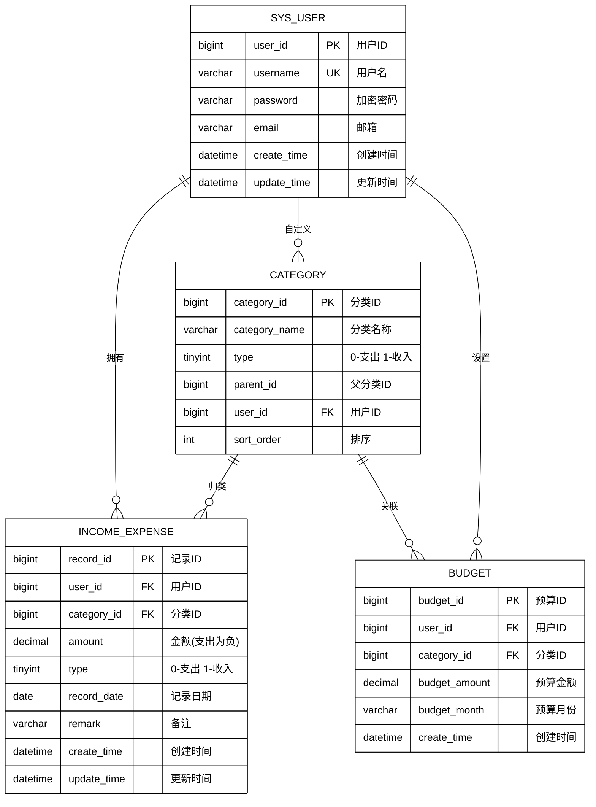

```mermaid
%%{init: {
    'theme': 'base',
    'themeVariables': {
        'primaryColor': '#ffffff',
        'primaryTextColor': '#000000',
        'primaryBorderColor': '#000000',
        'lineColor': '#000000'
    }
}}%%
erDiagram
    SYS_USER ||--o{ INCOME_EXPENSE : "拥有"
    SYS_USER ||--o{ CATEGORY : "自定义"
    SYS_USER ||--o{ BUDGET : "设置"
    CATEGORY ||--o{ INCOME_EXPENSE : "归类"
    CATEGORY ||--o{ BUDGET : "关联"
    
    SYS_USER {
        bigint user_id PK "用户ID"
        varchar username UK "用户名"
        varchar password "加密密码"
        varchar email "邮箱"
        datetime create_time "创建时间"
        datetime update_time "更新时间"
    }
    
    CATEGORY {
        bigint category_id PK "分类ID"
        varchar category_name "分类名称"
        tinyint type "0-支出 1-收入"
        bigint parent_id "父分类ID"
        bigint user_id FK "用户ID"
        int sort_order "排序"
    }
    
    INCOME_EXPENSE {
        bigint record_id PK "记录ID"
        bigint user_id FK "用户ID"
        bigint category_id FK "分类ID"
        decimal amount "金额(支出为负)"
        tinyint type "0-支出 1-收入"
        date record_date "记录日期"
        varchar remark "备注"
        datetime create_time "创建时间"
        datetime update_time "更新时间"
    }
    
    BUDGET {
        bigint budget_id PK "预算ID"
        bigint user_id FK "用户ID"
        bigint category_id FK "分类ID"
        decimal budget_amount "预算金额"
        varchar budget_month "预算月份"
        datetime create_time "创建时间"
    }
```