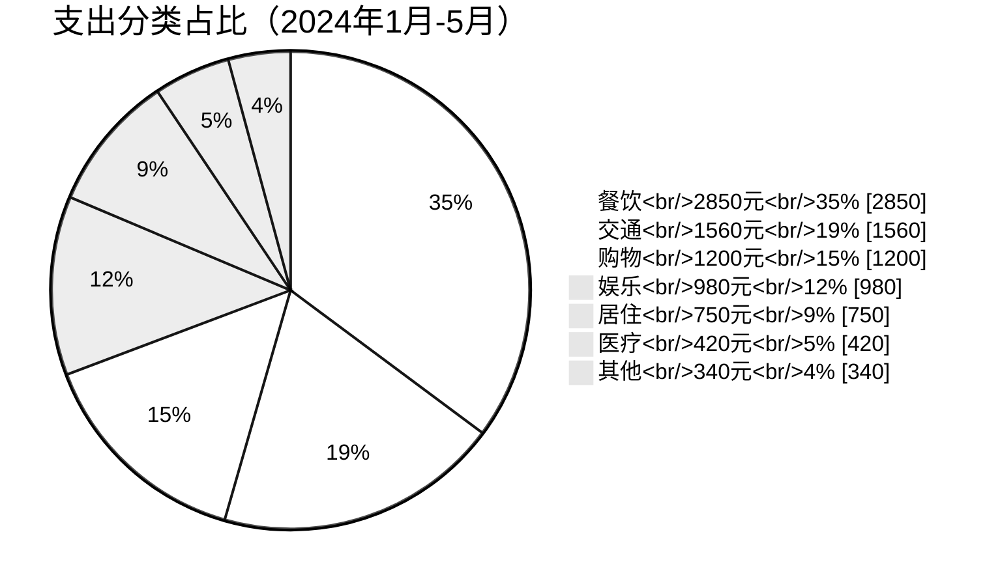

```mermaid
%%{init: {
    'theme': 'base',
    'themeVariables': {
        'primaryColor': '#ffffff',
        'primaryTextColor': '#000000',
        'primaryBorderColor': '#000000',
        'lineColor': '#000000',
        'fontSize': '12px'
    },
    'pie': {
        'maxWidth': 240,
        'minWidth': 200,
        'radius': 0.8,
        'labelPosition': 0.5
    }
}}%%
pie showData
    title 支出分类占比（2024年1月-5月）
    "餐饮<br/>2850元<br/>35%" : 2850
    "交通<br/>1560元<br/>19%" : 1560
    "购物<br/>1200元<br/>15%" : 1200
    "娱乐<br/>980元<br/>12%" : 980
    "居住<br/>750元<br/>9%" : 750
    "医疗<br/>420元<br/>5%" : 420
    "其他<br/>340元<br/>4%" : 340
```