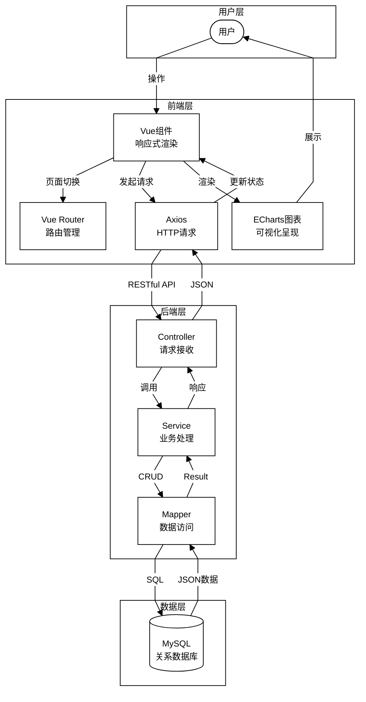

```mermaid
%%{init: {
    'theme': 'base',
    'themeVariables': {
        'primaryColor': '#ffffff',
        'primaryTextColor': '#000000',
        'primaryBorderColor': '#000000',
        'lineColor': '#000000',
        'secondaryColor': '#ffffff',
        'tertiaryColor': '#ffffff',
        'clusterBkg': '#ffffff',
        'clusterBorder': '#000000',
        'fontSize': '12px'
    },
    'flowchart': {
        'rankSpacing': 40,
        'nodeSpacing': 20,
        'curve': 'linear',
        'useMaxWidth': true,
        'maxWidth': 140
    }
}}%%
flowchart TD
    %% 分层节点，适配A4纵向宽度，优化文字换行减少节点宽度
    subgraph 用户层
        U([用户])
    end
    
    subgraph 前端层
        direction TB
        R[Vue Router<br/>路由管理]
        V[Vue组件<br/>响应式渲染]
        E[ECharts图表<br/>可视化呈现]
        A[Axios<br/>HTTP请求]
    end
    
    subgraph 后端层
        direction TB
        C[Controller<br/>请求接收]
        S[Service<br/>业务处理]
        M[Mapper<br/>数据访问]
    end
    
    subgraph 数据层
        DB[(MySQL<br/>关系数据库)]
    end

    %% 核心流程逻辑（和原图完全一致，仅调整布局方向）
    U -->|操作| V
    V -->|页面切换| R
    V -->|发起请求| A
    A -->|RESTful API| C
    C -->|调用| S
    S -->|CRUD| M
    M -->|SQL| DB
    
    %% 数据返回链路
    DB -->|JSON数据| M
    M -->|Result| S
    S -->|响应| C
    C -->|JSON| A
    A -->|更新状态| V
    V -->|渲染| E
    E -->|展示| U
```