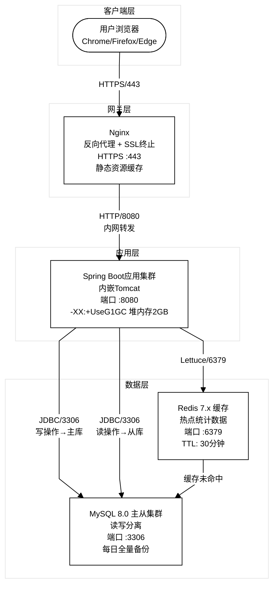

```mermaid
%%{init: {
    'theme': 'base',
    'themeVariables': {
        'primaryColor': '#ffffff',
        'primaryTextColor': '#000000',
        'primaryBorderColor': '#000000',
        'lineColor': '#000000',
        'secondaryColor': '#ffffff',
        'tertiaryColor': '#ffffff',
        'fontSize': '12px'
    },
    'flowchart': {
        'rankSpacing': 40,
        'nodeSpacing': 25,
        'curve': 'linear',
        'useMaxWidth': true,
        'maxWidth': 140
    }
}}%%
flowchart TB
    subgraph 客户端层
        U([用户浏览器<br/>Chrome/Firefox/Edge])
    end
    
    subgraph 网关层
        N[Nginx<br/>反向代理 + SSL终止<br/>HTTPS :443<br/>静态资源缓存]
    end
    
    subgraph 应用层
        direction TB
        APP[Spring Boot应用集群<br/>内嵌Tomcat<br/>端口 :8080<br/>-XX:+UseG1GC 堆内存2GB]
    end
    
    subgraph 数据层
        direction TB
        DB[MySQL 8.0 主从集群<br/>读写分离<br/>端口 :3306<br/>每日全量备份]
        R[Redis 7.x 缓存<br/>热点统计数据<br/>端口 :6379<br/>TTL: 30分钟]
    end
    
    U -->|HTTPS/443| N
    N -->|HTTP/8080<br/>内网转发| APP
    APP -->|JDBC/3306<br/>写操作→主库| DB
    APP -->|JDBC/3306<br/>读操作→从库| DB
    APP -->|Lettuce/6379| R
    R -->|缓存未命中| DB
```