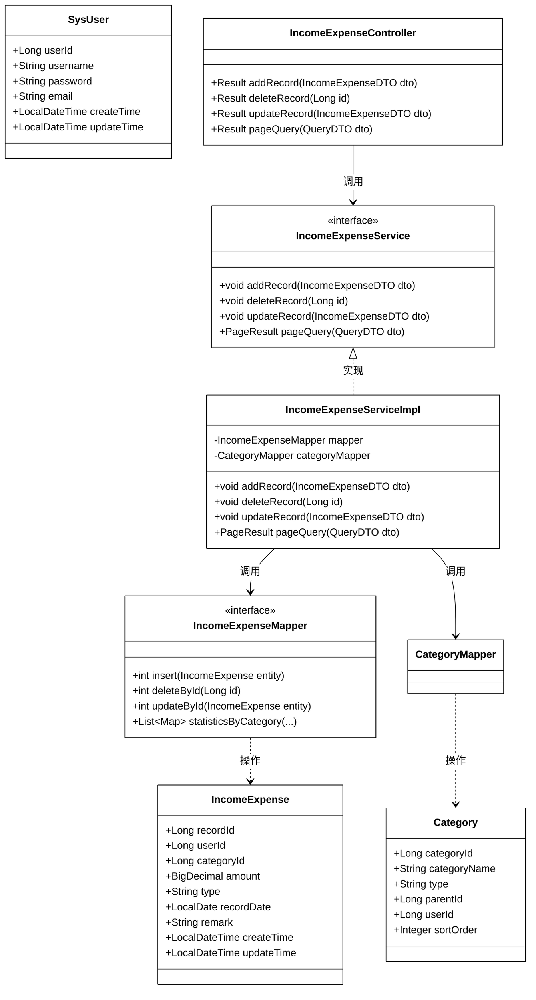

```mermaid
%%{init: {
    'theme': 'base',
    'themeVariables': {
        'primaryColor': '#fff',
        'primaryTextColor': '#000',
        'primaryBorderColor': '#000',
        'lineColor': '#000',
        'secondaryColor': '#fff',
        'tertiaryColor': '#fff',
        'nodeBorder': '#000',
        'classText': '#000',
        'attributeText': '#000'
    }
}}%%
classDiagram
    class IncomeExpense {
        +Long recordId
        +Long userId
        +Long categoryId
        +BigDecimal amount
        +String type
        +LocalDate recordDate
        +String remark
        +LocalDateTime createTime
        +LocalDateTime updateTime
    }

    class Category {
        +Long categoryId
        +String categoryName
        +String type
        +Long parentId
        +Long userId
        +Integer sortOrder
    }

    class SysUser {
        +Long userId
        +String username
        +String password
        +String email
        +LocalDateTime createTime
        +LocalDateTime updateTime
    }

    class IncomeExpenseController {
        +Result addRecord(IncomeExpenseDTO dto)
        +Result deleteRecord(Long id)
        +Result updateRecord(IncomeExpenseDTO dto)
        +Result pageQuery(QueryDTO dto)
    }

    class IncomeExpenseService {
        <<interface>>
        +void addRecord(IncomeExpenseDTO dto)
        +void deleteRecord(Long id)
        +void updateRecord(IncomeExpenseDTO dto)
        +PageResult pageQuery(QueryDTO dto)
    }

    class IncomeExpenseServiceImpl {
        -IncomeExpenseMapper mapper
        -CategoryMapper categoryMapper
        +void addRecord(IncomeExpenseDTO dto)
        +void deleteRecord(Long id)
        +void updateRecord(IncomeExpenseDTO dto)
        +PageResult pageQuery(QueryDTO dto)
    }

    class IncomeExpenseMapper {
        <<interface>>
        +int insert(IncomeExpense entity)
        +int deleteById(Long id)
        +int updateById(IncomeExpense entity)
        +List~Map~ statisticsByCategory(...)
    }

    IncomeExpenseController --> IncomeExpenseService : 调用
    IncomeExpenseService <|.. IncomeExpenseServiceImpl : 实现
    IncomeExpenseServiceImpl --> IncomeExpenseMapper : 调用
    IncomeExpenseServiceImpl --> CategoryMapper : 调用
    IncomeExpenseMapper ..> IncomeExpense : 操作
    CategoryMapper ..> Category : 操作
```