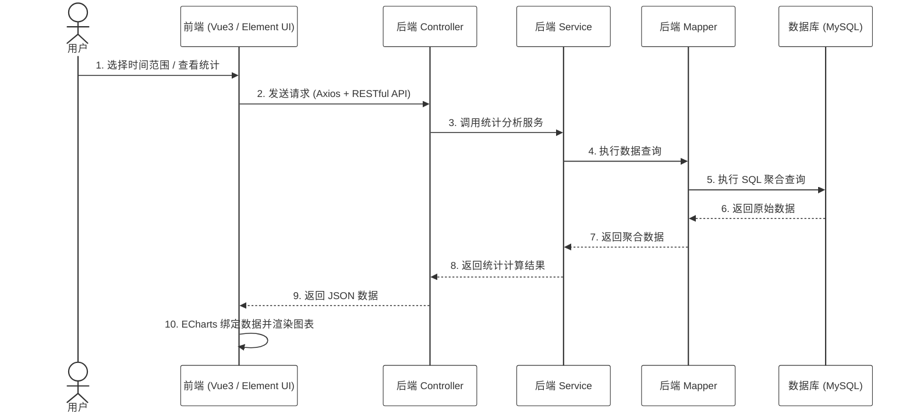

```mermaid
%%{init: { 'theme':'base', 'themeVariables': {
  'actorBkg':'#ffffff',
  'actorBorder':'#333333',
  'participantBkg':'#ffffff',
  'participantBorder':'#333333',
  'lineColor':'#333333'
}}}%%
sequenceDiagram
    actor User as 用户
    participant Frontend as 前端 (Vue3 / Element UI)
    participant Controller as 后端 Controller
    participant Service as 后端 Service
    participant Mapper as 后端 Mapper
    participant DB as 数据库 (MySQL)

    User->>Frontend: 1. 选择时间范围 / 查看统计
    Frontend->>Controller: 2. 发送请求 (Axios + RESTful API)
    Controller->>Service: 3. 调用统计分析服务
    Service->>Mapper: 4. 执行数据查询
    Mapper->>DB: 5. 执行 SQL 聚合查询
    DB-->>Mapper: 6. 返回原始数据
    Mapper-->>Service: 7. 返回聚合数据
    Service-->>Controller: 8. 返回统计计算结果
    Controller-->>Frontend: 9. 返回 JSON 数据
    Frontend->>Frontend: 10. ECharts 绑定数据并渲染图表
```