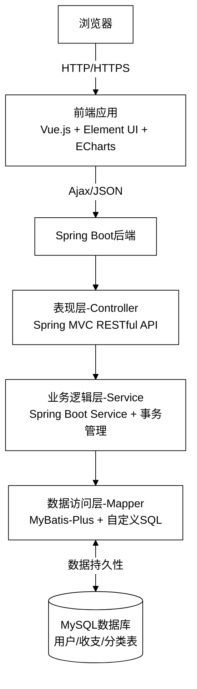

```mermaid
%%{init: {
    'theme': 'base',
    'themeVariables': {
        'primaryColor': '#ffffff',
        'primaryTextColor': '#000000',
        'primaryBorderColor': '#000000',
        'lineColor': '#000000',
        'secondaryColor': '#ffffff',
        'tertiaryColor': '#ffffff',
        'nodeBorder': '#000000',
        'clusterBkg': '#ffffff',
        'clusterBorder': '#000000'
    }
}}%%
flowchart TD
    Browser[浏览器]
    Frontend[前端应用<br/>Vue.js + Element UI + ECharts]
    Backend[Spring Boot后端]
    Controller[表现层-Controller<br/>Spring MVC RESTful API]
    Service[业务逻辑层-Service<br/>Spring Boot Service + 事务管理]
    Mapper[数据访问层-Mapper<br/>MyBatis-Plus + 自定义SQL]
    DB[(MySQL数据库<br/>用户/收支/分类表)]

    Browser -->|HTTP/HTTPS| Frontend
    Frontend -->|Ajax/JSON| Backend
    Backend --> Controller
    Controller --> Service
    Service --> Mapper
    Mapper <-->|数据持久性| DB
```